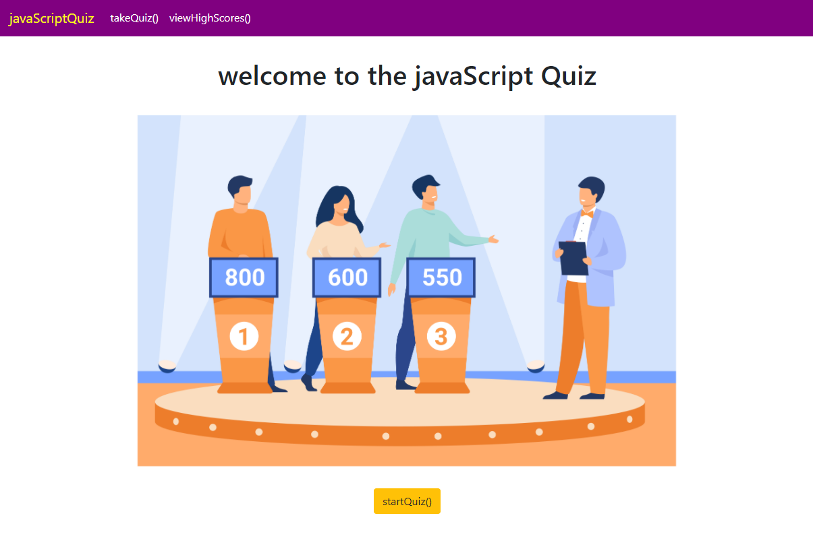

# javascript-quiz

Take this quiz on JavaScript. Don't take too long, there's a timer!

You'll get alerted on if you anwswer right or wrong, and you'll get a final score as well.

The app uses local storage as a pseudo-database; take multiple tests to see how the app handles multiple users.

Uses Bootstrap for styling, and all HTML is dynamically rendered with JS. 

